# Hackathon-3
# Aluno: Robson do Amaral Diógenes
## Atividade 01:
#### Token
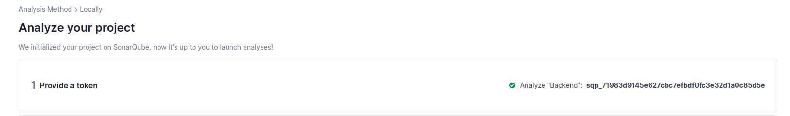
#### Overview
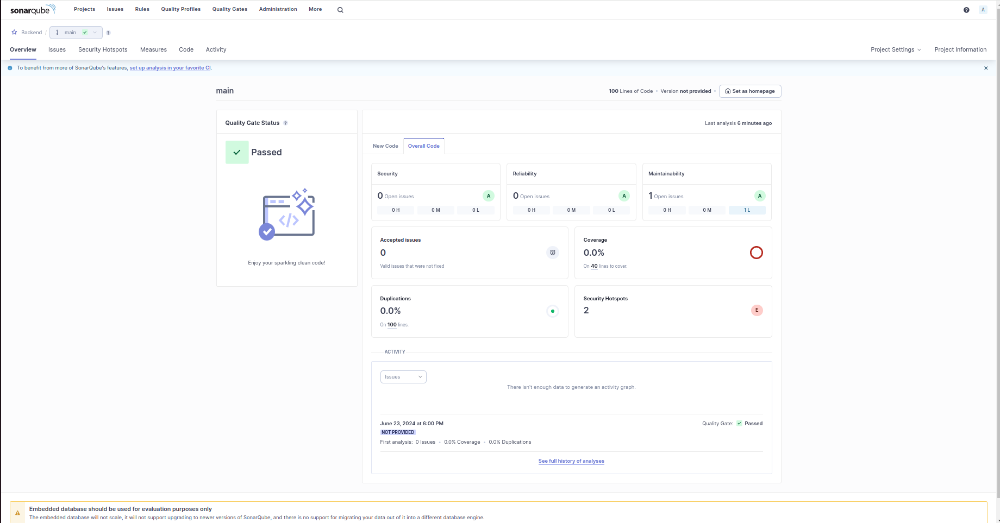
#### Issues
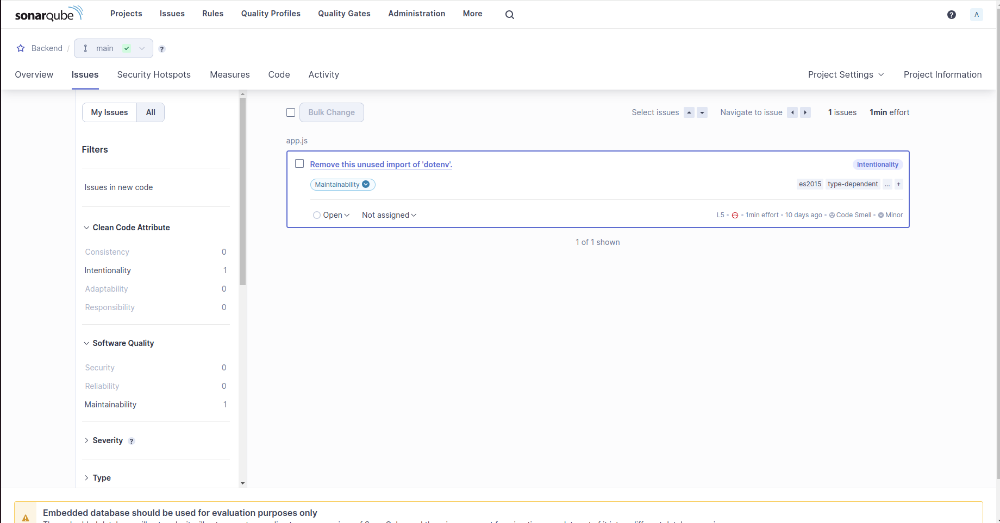
#### Security Hotspots
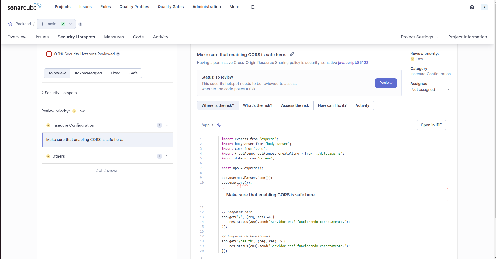
#### Measures
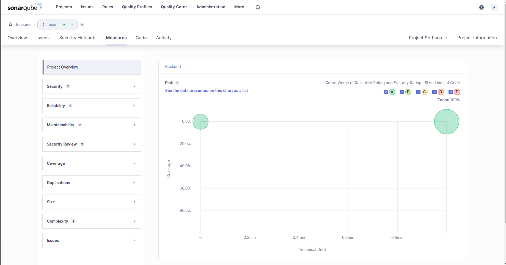
#### Code
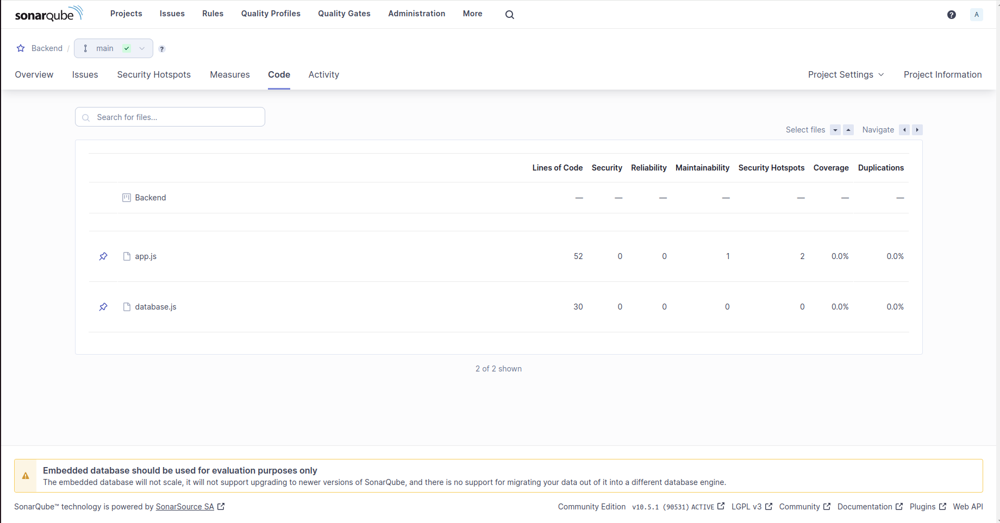
#### Activity
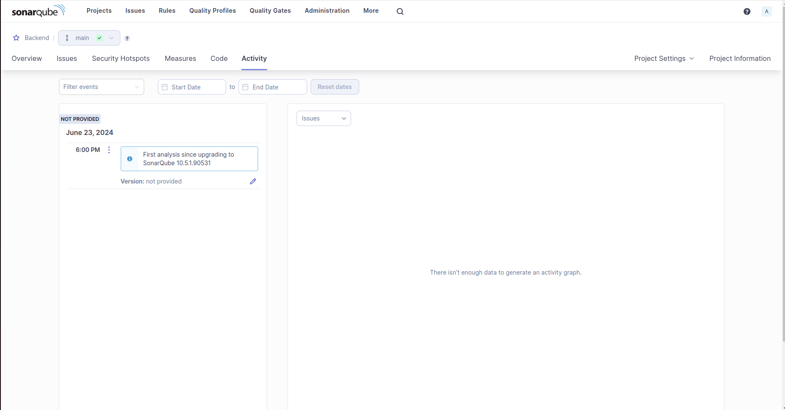
## Atividade 02:
#### Deploy.yml
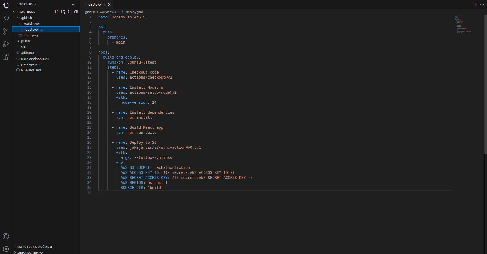
#### Github actions
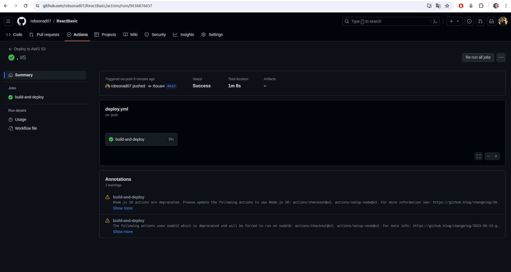

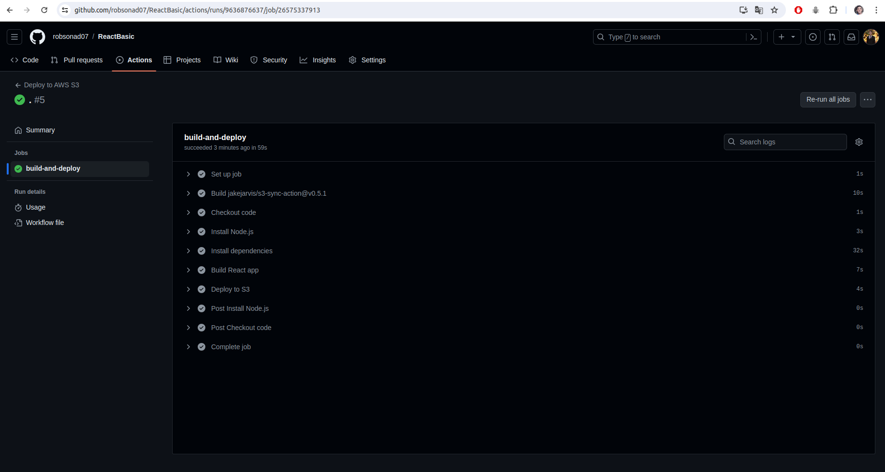
#### Bucket
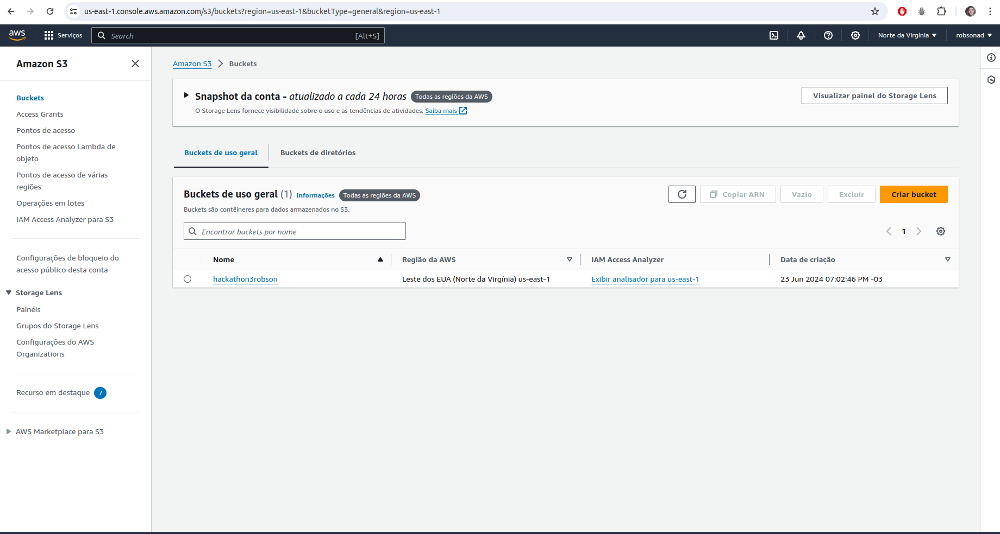
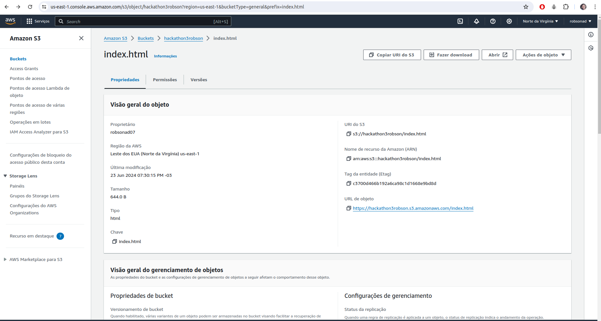
#### Deploy
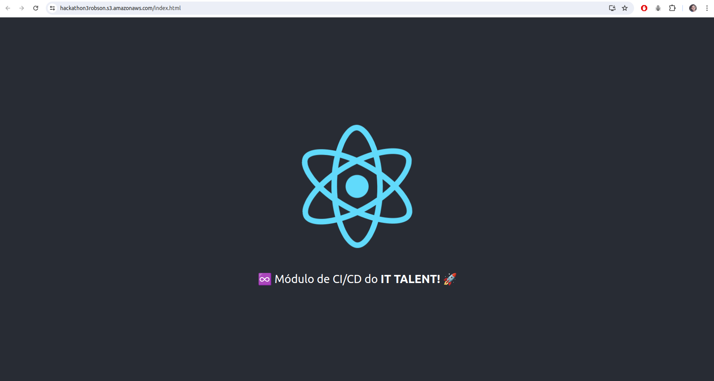

## Repositórios relacionados:
- https://github.com/robsonad07/ReactBasic
- https://github.com/robsonad07/Backend-IT_Talent
